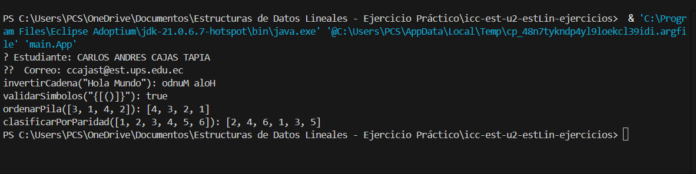

# 📚 Práctica: Estructuras Lineales en Java

**Autor:** Carlos Andrés Cajas Tapia  
**Materia:** Estructura de Datos  
**Unidad:** U2 – Estructuras Lineales  
**Profesor:** Ing. Pablo Torres  
**Fecha:** [Coloca la fecha de entrega]  

---

## 🎯 Objetivo

Implementar y aplicar estructuras de datos lineales como **pilas (Stacks)** y **listas enlazadas (LinkedList)** en Java para resolver problemas comunes como inversión de texto, validación de expresiones, clasificación por paridad y ordenamiento de datos.

---

## 📁 Estructura del Proyecto

```
icc-est-u2-estLin-ejercicios/
│
├── main/
│   ├── App.java                      // Clase principal (main)
│   └── LogicaClasificacion.java     // Lógica de los ejercicios
│
└── utils/
    └── StudentValidator.java        // Clase para validar los datos del estudiante
```

---

## 🧠 Ejercicios Implementados

### 1. 🔁 Invertir una Cadena con Pila

**Método:** `invertirCadena(String texto)`  
**Descripción:**  
Invierte una cadena de texto utilizando una pila (`Stack<Character>`) para almacenar temporalmente cada carácter.

**Ejemplo:**
```java
Entrada: "Hola Mundo"
Salida:  "odnuM aloH"
```

---

### 2. 🔐 Validar Símbolos Balanceados

**Método:** `validarSimbolos(String expresion)`  
**Descripción:**  
Verifica si los paréntesis `()`, corchetes `[]` y llaves `{}` en una expresión están correctamente balanceados. Se usa una pila para almacenar los símbolos de apertura y verificar que coincidan con los de cierre.

**Ejemplo:**
```java
Entrada: "{[()]}"
Salida:  true
```

---

### 3. 📥 Ordenar Pila

**Método:** `ordenarPila(Stack<Integer> pila)`  
**Descripción:**  
Ordena una pila de enteros **en orden ascendente** utilizando otra pila auxiliar. Al final, retorna una lista con los valores ordenados.

**Ejemplo:**
```java
Entrada: [3, 1, 4, 2]
Salida:  [1, 2, 3, 4]
```

---

### 4. 📊 Clasificar por Paridad

**Método:** `clasificarPorParidad(LinkedList<Integer> original)`  
**Descripción:**  
Separa los elementos de la lista original en **pares** e **impares**, manteniendo el orden de inserción original. Primero se añaden todos los pares y luego los impares.

**Ejemplo:**
```java
Entrada: [1, 2, 3, 4, 5, 6]
Salida:  [2, 4, 6, 1, 3, 5]
```

---

## 🧪 Ejecución del Programa

La clase `App.java` contiene pruebas unitarias para cada uno de los métodos implementados.

```bash
javac App.java
java main.App
```

**Salida esperada:**
```
👤 Estudiante: Carlos Andrés Cajas Tapia
✉️  Correo: [correo del estudiante]
invertirCadena("Hola Mundo"): odnuM aloH
validarSimbolos("{[()]}"): true
ordenarPila([3, 1, 4, 2]): [1, 2, 3, 4]
clasificarPorParidad([1, 2, 3, 4, 5, 6]): [2, 4, 6, 1, 3, 5]
```

---
## Resultados de Ejecución

---
## ✅ Conclusión

Este proyecto demuestra cómo aplicar estructuras de datos **lineales** en problemas reales. Las pilas permiten controlar el orden de entrada/salida (LIFO), mientras que las listas enlazadas proporcionan flexibilidad para recorrer y manipular datos según condiciones como paridad.

---

## 📌 Recomendaciones

- Recuerda probar cada función con más casos extremos.
- Puedes usar `JUnit` para automatizar las pruebas.
- Explora cómo implementar lo mismo con estructuras propias (`Node`, `MyStack`, `MyLinkedList`, etc.).

